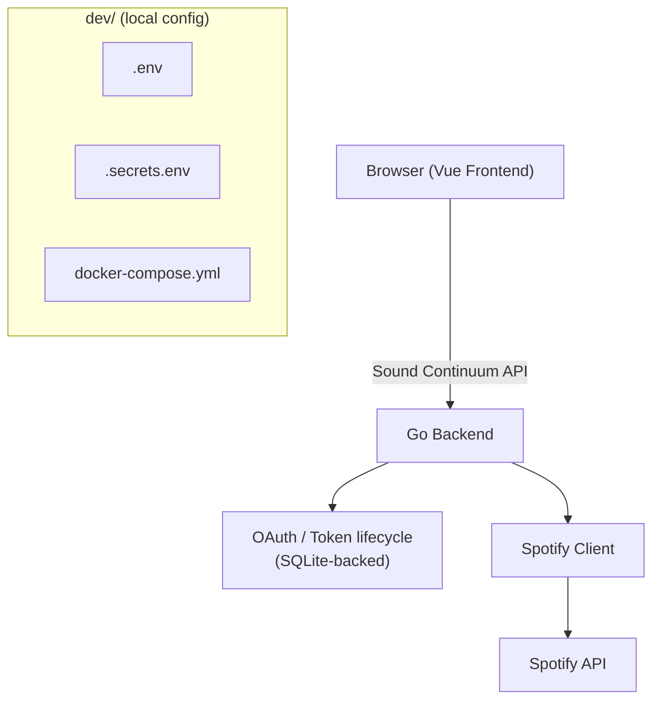

# Spotify Integration Architecture (M3)

Architecture and local configuration boundaries for Sound Continuum's
Spotify integration, established by Card #24. **This is a design document
— no Spotify OAuth, client, or API code exists yet.** Implementation starts
with a later card. For Spotify/Last.fm API capabilities and limitations,
see [`docs/spotify-api.md`](spotify-api.md) (Card 23 research) — this
document does not duplicate that research.

## 1. Purpose

Define, before any Spotify code is written, how the frontend, backend, and
Spotify fit together; who owns OAuth and tokens; where local configuration
lives; and what the initial backend structure and API boundary should be —
so later cards implement against settled decisions instead of re-deriving
them.

## 2. Architecture overview

```
Vue Frontend
      |
      | Sound Continuum HTTP API
      v
Go Backend
      |
      | Spotify Web API
      v
   Spotify
```

The Vue frontend never talks to Spotify directly. The Go backend owns
OAuth, tokens, and all Spotify API communication; the frontend only calls
Sound Continuum's own API. See the full diagram in
[§18](#18-architecture-diagram).

## 3. Local development configuration

All local development configuration — Docker Compose and both environment
files — is centralized under `dev/`:

```
dev/
├── docker-compose.yml
├── .env
└── .secrets.env
```

Neither `dev/.env` nor `dev/.secrets.env` is committed. Setup instructions
and the expected variable names live in the root
[`README.md`](../README.md#environment-configuration) — not duplicated
here.

## 4. Environment file conventions

- **`dev/.env`** — non-secret local configuration: ports, base URLs,
  `SPOTIFY_REDIRECT_URI`. The Spotify Client ID is not secret and would
  also belong here if the backend ever needs it outside `.secrets.env`
  (currently it's kept in `.secrets.env` alongside the Client Secret to
  keep all Spotify credentials in one file — see below).
- **`dev/.secrets.env`** — local secrets: `SPOTIFY_CLIENT_ID`,
  `SPOTIFY_CLIENT_SECRET`. `LASTFM_API_KEY` is intentionally not stubbed
  here — Last.fm is out of M3 scope ([§17](#17-lastfm-boundary)).
- Docker Compose loads `dev/.env` into both the `backend` and `frontend`
  services via `env_file:`, and `dev/.secrets.env` into `backend` only —
  the frontend container structurally cannot see `SPOTIFY_CLIENT_SECRET`.
- Vite's `VITE_*` prefix makes a variable client-visible. No secret is
  ever assigned to a `VITE_*` variable — never `VITE_SPOTIFY_CLIENT_SECRET`
  or equivalent.

## 5. Frontend/backend boundary

The Go backend owns Spotify OAuth, client credentials, access tokens,
refresh tokens, Spotify API communication, and Spotify-specific error
handling. The frontend communicates only with the Sound Continuum backend
and knows only application-level state (`connected` / `disconnected` /
`authorization_required`), never Spotify tokens or credentials.

## 6. OAuth architecture

**Selected flow: Authorization Code (without PKCE).**

The application has one human curator, a Go backend that can safely hold a
client secret, and a browser frontend that never talks to Spotify
directly. PKCE exists to protect *public* clients that cannot hold a
secret (e.g. a pure browser SPA calling Spotify directly); it doesn't
apply here, since the backend — a confidential client — terminates the
entire flow, including the token exchange. Plain Authorization Code is
simpler and sufficient.

Client Credentials (app-only, no user context) may additionally be used
later for anonymous catalog lookups (search, public artist/track
metadata) that don't require the curator's identity — see
[`docs/spotify-api.md`](spotify-api.md#21-authentication). That's a
separate, simpler flow from the curator-auth flow described here and
isn't designed further in this document.

## 7. Redirect URI

`SPOTIFY_REDIRECT_URI` (`dev/.env`), pointing at the backend callback
route ([§11](#11-oauth-redirect-boundary)):
`http://localhost:8080/api/spotify/callback` in local development. Must
match the URI registered in the Spotify app dashboard exactly.

## 8. Token ownership

The Go backend owns the access token, refresh token, and token expiration
state end to end. The frontend never receives or persists a Spotify
token, authorization code, or client secret.

## 9. Token storage decision

**Decision: store the Spotify refresh token in SQLite**, not environment
files and not process memory.

- **Environment files** are for static local configuration. A refresh
  token is runtime application state that changes over time (re-issued on
  refresh, invalidated on `invalid_grant`) — putting it in `dev/.secrets.env`
  would conflate static config with mutable state and require rewriting a
  config file from application code.
- **Process memory** would lose the token on every backend restart,
  forcing the curator to re-authorize weekly (or more often, during
  development) — poor fit for a low-frequency, human-driven workflow.
- **SQLite** is already-provisioned MVP infrastructure (a named volume is
  reserved for it — see [`current-state.md`](memory/current-state.md)),
  requires no new infrastructure, and persists across restarts. It fits
  the single-curator, single-connection MVP scope directly: one row for
  the one Spotify connection.

No token persistence code is written by this card — this is the decision
a later card implements against.

## 10. Spotify client boundary

The future Go Spotify client owns: authenticated Spotify HTTP requests,
access-token attachment, token refresh coordination, Spotify API error
translation, `401`/`429`/`Retry-After` handling, and Spotify
request/response models.

It does not own: editorial rules, discovery algorithms, ranking, musical
bridges, playlist editorial decisions, or Last.fm — those remain Sound
Continuum business logic, separate from the Spotify client.

## 11. Backend structure

Minimal structure sufficient for the next implementation cards, following
the existing `backend/cmd/`, `backend/internal/` convention:

```
backend/
├── cmd/
│   └── server/
└── internal/
    └── spotify/
```

No provider abstraction, no repository interfaces without implementations,
no generic service layer — `internal/spotify/` is a concrete package for
Spotify specifically, added when implementation actually starts.

## 12. Application API boundary

Initial application-level endpoints for Spotify integration:

```
GET /api/spotify/auth
GET /api/spotify/callback
GET /api/spotify/status
```

Conceptually:

```
Browser
   |
   | GET /api/spotify/auth
   v
Go Backend
   |
   | redirect
   v
Spotify
   |
   | callback
   v
Go Backend
   |
   | redirect / response
   v
Browser
```

The frontend consumes only these Sound Continuum endpoints — never raw
Spotify endpoint shapes. Data endpoints (search, playlist management) are
scoped to later cards, not defined here.

## 13. Error handling boundary

The backend translates Spotify-side failures — `401` (invalid/expired
access token), `403`, `404`, `429`, refresh failure/`invalid_grant`, and
malformed responses — into meaningful application-level errors before
they reach the frontend, rather than passing through raw Spotify error
shapes. Implementation is deferred to the card that builds the Spotify
client.

## 14. Rate-limit strategy

Sound Continuum operates under Spotify Development Mode as a permanent
baseline (see [`docs/spotify-api.md`](spotify-api.md#29-rate-limits--quotas)),
running a low-volume, weekly, human-driven workflow well under Development
Mode's ceiling. The Spotify client should handle `429` and `Retry-After`
with simple backoff. No queue, no Redis, no distributed rate limiting, no
background workers.

## 15. Security boundaries

- Spotify Client Secret: backend only, never in the frontend, never in
  `VITE_*` variables.
- Spotify tokens: backend only, never sent to the frontend, never in URLs
  or logs.
- Authorization codes: never logged.
- No secrets committed to Git — `dev/.env` and `dev/.secrets.env` are
  gitignored.
- No credentials in Dockerfiles, README, or any documentation.

## 16. Single-user MVP assumptions

This architecture assumes one curator, one Spotify connection, local
development, no public user accounts, and no multi-user Spotify
credentials or team accounts. Multi-user authentication is explicitly out
of scope for the MVP.

## 17. Last.fm boundary

Last.fm remains out of scope for M3 (reaffirms the existing decision in
[`docs/memory/decisions.md`](memory/decisions.md)). No Last.fm dependency,
client, configuration, or environment variable is introduced by this
architecture. Last.fm is a candidate discovery/similarity source for M4;
this architecture doesn't design for it, but a Spotify-specific
`internal/spotify/` package (rather than a generic provider abstraction)
keeps that future work unblocked without speculative code now.

## 18. Architecture diagram



`dev/` is local development configuration, shown separately since it
configures the environment, not the runtime architecture itself.

## 19. Open questions

- Whether `POST /users/{user_id}/playlists` (create-for-user) still works
  or was removed — flagged as unresolved in
  [`docs/spotify-api.md`](spotify-api.md#12-open-questions); relevant once
  playlist creation is implemented, not to this architecture.
- Whether Client Credentials (anonymous catalog lookups) and Authorization
  Code (curator auth) should share `internal/spotify/` or be split
  further — deferred to the implementation card, since no code exists yet
  to make that call concrete.

## 20. Decisions

Full entries with reasoning live in
[`docs/memory/decisions.md`](memory/decisions.md). Summary of what this
card decided:

- Local development configuration is centralized under `dev/`.
- `dev/.env` holds non-secret config; `dev/.secrets.env` holds secrets;
  both are gitignored.
- The Spotify integration is entirely backend-owned; the frontend never
  holds Spotify secrets or tokens.
- OAuth terminates at the Go backend, using Authorization Code (not
  PKCE).
- Spotify refresh tokens are stored in SQLite, not env files or process
  memory.
- Last.fm remains outside M3.
- The MVP assumes a single Spotify curator connection.
