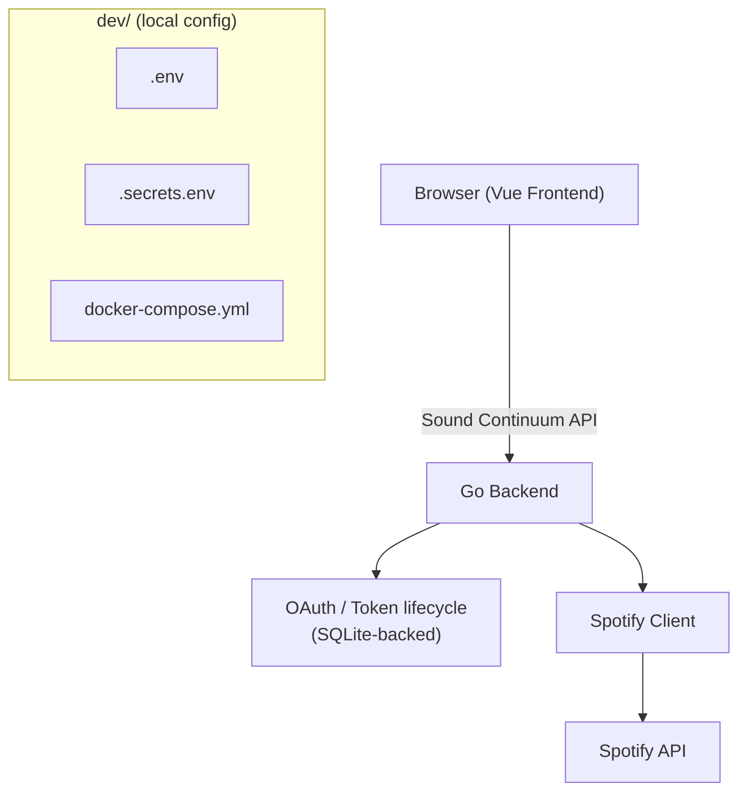

# Spotify Integration Architecture (M3)

Architecture and local configuration boundaries for Sound Continuum's
Spotify integration, established by Card #24. **This is a design document
— no Spotify OAuth, client, or API code exists yet.** Implementation starts
with a later card. For Spotify/Last.fm API capabilities and limitations,
see [`docs/spotify-api.md`](spotify-api.md) (Card 23 research) — this
document does not duplicate that research.

## 1. Purpose

Define, before any Spotify code is written, how the frontend, backend, and
Spotify fit together; who owns OAuth and tokens; where local configuration
lives; and what the initial backend structure and API boundary should be —
so later cards implement against settled decisions instead of re-deriving
them.

## 2. Architecture overview

```
Vue Frontend
      |
      | Sound Continuum HTTP API
      v
Go Backend
      |
      | Spotify Web API
      v
   Spotify
```

The Vue frontend never talks to Spotify directly. The Go backend owns
OAuth, tokens, and all Spotify API communication; the frontend only calls
Sound Continuum's own API. See the full diagram in
[§18](#18-architecture-diagram).

## 3. Local development configuration

All local development configuration — Docker Compose and both environment
files — is centralized under `dev/`:

```
dev/
├── docker-compose.yml
├── .env
└── .secrets.env
```

Neither `dev/.env` nor `dev/.secrets.env` is committed. Setup instructions
and the expected variable names live in the root
[`README.md`](../README.md#environment-configuration) — not duplicated
here.

## 4. Environment file conventions

- **`dev/.env`** — non-secret local configuration: ports, base URLs,
  `SPOTIFY_REDIRECT_URI`. The Spotify Client ID is not secret and would
  also belong here if the backend ever needs it outside `.secrets.env`
  (currently it's kept in `.secrets.env` alongside the Client Secret to
  keep all Spotify credentials in one file — see below).
- **`dev/.secrets.env`** — local secrets: `SPOTIFY_CLIENT_ID`,
  `SPOTIFY_CLIENT_SECRET`. `LASTFM_API_KEY` is intentionally not stubbed
  here — Last.fm is out of M3 scope ([§17](#17-lastfm-boundary)).
- Docker Compose loads `dev/.env` into both the `backend` and `frontend`
  services via `env_file:`, and `dev/.secrets.env` into `backend` only —
  the frontend container structurally cannot see `SPOTIFY_CLIENT_SECRET`.
- Vite's `VITE_*` prefix makes a variable client-visible. No secret is
  ever assigned to a `VITE_*` variable — never `VITE_SPOTIFY_CLIENT_SECRET`
  or equivalent.

## 5. Frontend/backend boundary

The Go backend owns Spotify OAuth, client credentials, access tokens,
refresh tokens, Spotify API communication, and Spotify-specific error
handling. The frontend communicates only with the Sound Continuum backend
and knows only application-level state (`connected` / `disconnected` /
`authorization_required`), never Spotify tokens or credentials.

## 6. OAuth architecture

**Selected flow: Authorization Code (without PKCE).**

The application has one human curator, a Go backend that can safely hold a
client secret, and a browser frontend that never talks to Spotify
directly. PKCE exists to protect *public* clients that cannot hold a
secret (e.g. a pure browser SPA calling Spotify directly); it doesn't
apply here, since the backend — a confidential client — terminates the
entire flow, including the token exchange. Plain Authorization Code is
simpler and sufficient.

Client Credentials (app-only, no user context) may additionally be used
later for anonymous catalog lookups (search, public artist/track
metadata) that don't require the curator's identity — see
[`docs/spotify-api.md`](spotify-api.md#21-authentication). That's a
separate, simpler flow from the curator-auth flow described here and
isn't designed further in this document.

## 7. Redirect URI

`SPOTIFY_REDIRECT_URI` (`dev/.env`), pointing at the backend callback
route ([§11](#11-oauth-redirect-boundary)):
`http://127.0.0.1:8080/api/spotify/callback` in local development. An
explicit loopback IP, not `localhost` — Spotify's dashboard rejects bare
`localhost` for a non-HTTPS redirect URI. Must match the URI registered in
the Spotify app dashboard exactly.

## 8. Token ownership

The Go backend owns the access token, refresh token, and token expiration
state end to end. The frontend never receives or persists a Spotify
token, authorization code, or client secret.

## 9. Token storage decision

**Decision: store the Spotify refresh token in SQLite**, not environment
files and not process memory.

- **Environment files** are for static local configuration. A refresh
  token is runtime application state that changes over time (re-issued on
  refresh, invalidated on `invalid_grant`) — putting it in `dev/.secrets.env`
  would conflate static config with mutable state and require rewriting a
  config file from application code.
- **Process memory** would lose the token on every backend restart,
  forcing the curator to re-authorize weekly (or more often, during
  development) — poor fit for a low-frequency, human-driven workflow.
- **SQLite** is already-provisioned MVP infrastructure (a named volume is
  reserved for it — see [`current-state.md`](memory/current-state.md)),
  requires no new infrastructure, and persists across restarts. It fits
  the single-curator, single-connection MVP scope directly: one row for
  the one Spotify connection.

No token persistence code is written by this card — this is the decision
a later card implements against.

## 10. Spotify client boundary

The future Go Spotify client owns: authenticated Spotify HTTP requests,
access-token attachment, token refresh coordination, Spotify API error
translation, `401`/`429`/`Retry-After` handling, and Spotify
request/response models.

It does not own: editorial rules, discovery algorithms, ranking, musical
bridges, playlist editorial decisions, or Last.fm — those remain Sound
Continuum business logic, separate from the Spotify client.

## 11. Backend structure

Minimal structure sufficient for the next implementation cards, following
the existing `backend/cmd/`, `backend/internal/` convention:

```
backend/
├── cmd/
│   └── server/
└── internal/
    └── spotify/
```

No provider abstraction, no repository interfaces without implementations,
no generic service layer — `internal/spotify/` is a concrete package for
Spotify specifically, added when implementation actually starts.

## 12. Application API boundary

Initial application-level endpoints for Spotify integration:

```
GET /api/spotify/auth
GET /api/spotify/callback
GET /api/spotify/status
```

Conceptually:

```
Browser
   |
   | GET /api/spotify/auth
   v
Go Backend
   |
   | redirect
   v
Spotify
   |
   | callback
   v
Go Backend
   |
   | redirect / response
   v
Browser
```

The frontend consumes only these Sound Continuum endpoints — never raw
Spotify endpoint shapes. Data endpoints (`/me`, `/playlists`,
`/playlists/{id}/items`, `/search`) were added in Card #26 — see
[§22](#22-implementation-card-26). Playlist *write* endpoints (create,
add/remove items) remain scoped to a later card.

## 13. Error handling boundary

The backend translates Spotify-side failures — `401` (invalid/expired
access token), `403`, `404`, `429`, refresh failure/`invalid_grant`, and
malformed responses — into meaningful application-level errors before
they reach the frontend, rather than passing through raw Spotify error
shapes. Implemented in Card #26 — see
[§22](#22-implementation-card-26).

## 14. Rate-limit strategy

Sound Continuum operates under Spotify Development Mode as a permanent
baseline (see [`docs/spotify-api.md`](spotify-api.md#29-rate-limits--quotas)),
running a low-volume, weekly, human-driven workflow well under Development
Mode's ceiling. The Spotify client should handle `429` and `Retry-After`
with simple backoff. No queue, no Redis, no distributed rate limiting, no
background workers.

## 15. Security boundaries

- Spotify Client Secret: backend only, never in the frontend, never in
  `VITE_*` variables.
- Spotify tokens: backend only, never sent to the frontend, never in URLs
  or logs.
- Authorization codes: never logged.
- No secrets committed to Git — `dev/.env` and `dev/.secrets.env` are
  gitignored.
- No credentials in Dockerfiles, README, or any documentation.

## 16. Single-user MVP assumptions

This architecture assumes one curator, one Spotify connection, local
development, no public user accounts, and no multi-user Spotify
credentials or team accounts. Multi-user authentication is explicitly out
of scope for the MVP.

## 17. Last.fm boundary

Last.fm remains out of scope for M3 (reaffirms the existing decision in
[`docs/memory/decisions.md`](memory/decisions.md)). No Last.fm dependency,
client, configuration, or environment variable is introduced by this
architecture. Last.fm is a candidate discovery/similarity source for M4;
this architecture doesn't design for it, but a Spotify-specific
`internal/spotify/` package (rather than a generic provider abstraction)
keeps that future work unblocked without speculative code now.

## 18. Architecture diagram



`dev/` is local development configuration, shown separately since it
configures the environment, not the runtime architecture itself.

## 19. Open questions

- Whether `POST /users/{user_id}/playlists` (create-for-user) still works
  or was removed — flagged as unresolved in
  [`docs/spotify-api.md`](spotify-api.md#12-open-questions); relevant once
  playlist creation is implemented, not to this architecture.
- Whether Client Credentials (anonymous catalog lookups) and Authorization
  Code (curator auth) should share `internal/spotify/` or be split
  further — still deferred. Card #26 only extended the existing
  Authorization Code flow (added scope, added API operations); no Client
  Credentials code was introduced, since every operation implemented so
  far needs the curator's own identity/playlists, not anonymous catalog
  access.

## 20. Decisions

Full entries with reasoning live in
[`docs/memory/decisions.md`](memory/decisions.md). Summary of what this
card decided:

- Local development configuration is centralized under `dev/`.
- `dev/.env` holds non-secret config; `dev/.secrets.env` holds secrets;
  both are gitignored.
- The Spotify integration is entirely backend-owned; the frontend never
  holds Spotify secrets or tokens.
- OAuth terminates at the Go backend, using Authorization Code (not
  PKCE).
- Spotify refresh tokens are stored in SQLite, not env files or process
  memory.
- Last.fm remains outside M3.
- The MVP assumes a single Spotify curator connection.

## 21. Implementation (Card #25)

OAuth Authorization Code flow and token lifecycle are implemented in
`backend/internal/spotify/`. No provider abstraction — a concrete package,
as designed in [§11](#11-backend-structure).

### Endpoints

```
GET /api/spotify/auth      starts the flow, redirects to Spotify
GET /api/spotify/callback  Spotify's redirect target; exchanges the code,
                            stores the connection, redirects back to the
                            frontend with ?spotify=connected|denied|error
GET /api/spotify/status    {"status": "connected"|"disconnected"|
                            "authorization_required", "display_name"?: string}
```

### Environment variables

`SPOTIFY_CLIENT_ID`, `SPOTIFY_CLIENT_SECRET`, `SPOTIFY_REDIRECT_URI` (see
`dev/.secrets.env` / `dev/.env`). `SQLITE_PATH` (not Spotify-specific):
defaults to `sound-continuum.db` relative to the backend's working
directory for host dev; `dev/docker-compose.yml` overrides it to
`/data/sound-continuum.db` for the backend container only, since the
correct value differs between host and container and `dev/.env` is shared
by both.

### Scope

Originally no OAuth scope was requested — `GET /v1/me` returns
`id`/`display_name` without one, which was enough to establish the
curator's identity. **Amended in Card #26**: `AuthURL` now requests
`user-read-private playlist-read-private`, the minimum needed for
`GET /me/playlists` and `GET /playlists/{id}/items` to return the
curator's own playlists. `email`/`country` remain removed from `/me`
regardless of scope (Spotify's February 2026 migration), so
`user-read-email` still adds nothing. Playlist *write* scopes
(`playlist-modify-public`/`-private`) remain out of scope, deferred to
whichever later card adds playlist creation/management. The scope change
required the curator to reconnect once via `GET /api/spotify/auth` — the
existing reconnect flow, no new mechanism.

### Token storage

Single-row `spotify_connection` table (SQLite, `modernc.org/sqlite` — pure
Go, no CGO; the project's first backend dependency, chosen over
`mattn/go-sqlite3` to avoid needing a C toolchain in the Alpine Docker
image):

```sql
CREATE TABLE IF NOT EXISTS spotify_connection (
    id              INTEGER PRIMARY KEY CHECK (id = 1),
    access_token    TEXT NOT NULL,
    refresh_token   TEXT NOT NULL,
    token_type      TEXT NOT NULL,
    expires_at      INTEGER NOT NULL,
    spotify_user_id TEXT NOT NULL,   -- /v1/me's account_id, falling back to id
    display_name    TEXT NOT NULL DEFAULT '',
    needs_reauth    INTEGER NOT NULL DEFAULT 0,
    updated_at      INTEGER NOT NULL
);
```

`needs_reauth` is a flag, not a row deletion, on `invalid_grant` — deleting
the row would collapse "never connected" and "connection needs
reauthorization" into the same state, but §5 commits the frontend to three
distinct states. `Upsert` (fresh connect or successful refresh) clears the
flag; only `invalid_grant` sets it.

### Token lifecycle

Refresh is lazy/on-demand, not a background worker: `GET /api/spotify/status`
(and any future Spotify API call) calls `Service.EnsureValidToken`, which
refreshes the access token if it's expired (30s leeway) before reporting
status. This matches the "no queue, no background workers" rate-limit
strategy already recorded in [§14](#14-rate-limit-strategy) — a low-frequency,
human-driven weekly workflow doesn't need proactive refresh scheduling.

On `invalid_grant` during refresh: the stored connection is flagged
`needs_reauth` (not deleted or retried), `/api/spotify/status` reports
`authorization_required`, and the curator re-authorizes via
`GET /api/spotify/auth` — a fresh `Upsert` clears the flag.

### Error handling

Missing/invalid state, missing code, and `error=access_denied` are all
handled without exchanging a code or leaking detail to the client —
the callback redirects to `frontendOrigin/?spotify=denied|error` and logs
the reason server-side only (never the code, secret, or token). Missing
Spotify configuration returns `503` from `/api/spotify/auth` rather than
crashing the server at boot (`dev/.secrets.env` ships empty by default).

### Manual integration test

See [README.md § Connect Spotify](../README.md#connect-spotify) for the
step-by-step test against the real Spotify API (create a dev app, register
the `127.0.0.1` redirect URI, connect, verify `/api/spotify/status`, confirm
persistence across a backend restart, confirm denied/invalid-state handling).

## 22. Implementation (Card #26)

A Spotify Web API client is added on top of Card #25's OAuth/token
lifecycle, in the same `backend/internal/spotify/` package — no new
package, no provider abstraction, as designed in
[§11](#11-backend-structure).

### Endpoints

```
GET /api/spotify/me                        curator's Spotify profile
GET /api/spotify/playlists?limit=&offset=  curator's own playlists
GET /api/spotify/playlists/{id}/items?limit=&offset=
                                            items in one of the curator's playlists
GET /api/spotify/search?q=&type=&limit=&offset=
                                            catalog search
```

All read-only. Playlist creation/management is not implemented.

### Token access and refresh

`Service.connection(ctx)` (renamed/extracted from the old
`EnsureValidToken` body) returns a live `Connection`, proactively
refreshing the access token if it's within 30s of expiry — the same lazy,
on-read refresh `EnsureValidToken` always did; `EnsureValidToken` is now a
thin wrapper over it, so `/api/spotify/status`'s contract is unchanged.

New for Card #26: `Service.withToken(ctx, fn)` additionally handles a
*reactive* `401` — Spotify rejecting a token that looked unexpired (clock
skew, revocation). It calls `fn` once with the current token; if `fn`
fails with `ErrUnauthorized`, it forces exactly one refresh via
`Service.refresh` and retries `fn` exactly once. No further retry. A
refresh failure (`ErrInvalidGrant`) flags the connection `needs_reauth`
(via the existing `Store.MarkNeedsReauth`) and is returned as-is — no new
invalidation mechanism was introduced.

Every new operation (`Service.Me`, `Playlists`, `PlaylistItems`, `Search`)
is a thin wrapper around `withToken`.

### Error handling

`errors.go` adds a Spotify Web API error taxonomy (distinct from
`ErrInvalidGrant`, which is specific to the token endpoint):
`ErrUnauthorized` (401), `ErrForbidden` (403), `ErrNotFound` (404),
`ErrRateLimited` (429, with `Retry-After` parsed into `APIError.RetryAfter`),
`ErrAPIFailure` (other 4xx/5xx), `ErrTransport` (network failure),
`ErrDecode` (malformed JSON). All are carried on `*APIError`
(`StatusCode`, `RetryAfter`, `Message` — Spotify's own message, never a
token) and checked via `errors.Is`/`errors.As`. HTTP handlers map these to
status codes (`writeSpotifyError`) without echoing internal detail;
`429` responses copy `Retry-After` onto the outgoing response header. No
retry loop, no queue, no background rate-limit handling — matches
[§14](#14-rate-limit-strategy).

`Client.Me` was refactored onto a new shared `Client.request` helper
(method/path/query/body/decode) to remove the ad-hoc per-endpoint HTTP
boilerplate Card #25 left in place for a single endpoint; its exported
signature is unchanged.

### Response types

`types.go` adds `Paging[T]` (Spotify's pagination envelope, generic over
`Playlist`/`PlaylistItem`/`Track`/`Artist`), plus those four types. These
are integration-layer representations only — no Sound Continuum domain
model (e.g. `CandidateTrack`, `ContinuumTrack`) exists yet.

**Confirmed live against the real API, correcting two assumptions from
[`docs/spotify-api.md`](spotify-api.md):**

- A playlist's item-count summary is returned under the JSON key
  `"items"`, not `"tracks"` — the `/tracks`→`/items` rename applies to
  this field too, not only the endpoint path.
- Each playlist item's track payload is nested under the JSON key
  `"item"`, not `"track"`.

Search's response shape (`SearchResult`) was **not** verified live (no
playlist/track search was exercised in the manual test) — treat its field
names as best-effort until a future card actually depends on them.

### Search limit

Spotify's Development Mode caps search `limit` at 10. `Client.Search`
rejects (`ErrSearchLimitTooHigh`) rather than silently clamps a higher
value; `SearchHandler` maps that to `400`.

### Testing

`client_test.go` and `handlers_test.go` extended, same conventions as
Card #25 (one `TestXxx` per scenario, no table tests, `httptest.Server`).
Covers: successful authenticated requests for each new operation; query
parameter encoding; 401→refresh→retry-once→success; failed refresh
(`invalid_grant`) → `needs_reauth` set, no retry; 403/404/429/500 mapped
to typed errors; malformed JSON → decode error; search limit rejection.

### Real Spotify integration test

Performed against the real Spotify API using the existing dev app
(`dev/.secrets.env`), after the curator reconnected once for the new
scope. Result: `GET /api/spotify/me` returned the real profile;
`GET /api/spotify/playlists` returned the curator's real playlists
(paginated, 86 total); `GET /api/spotify/playlists/{id}/items` returned
real track data for an owned playlist (correct after the `items`/`item`
field-name fix above). Server logs contained no tokens, secrets, or
Authorization headers at any point.

## 23. Implementation (Card #27)

Single-playlist retrieval and playlist-item type discrimination are added
on top of Card #26's playlist list/items client, in the same
`backend/internal/spotify/` package.

### Endpoints

```
GET /api/spotify/playlists/{id}    metadata for one playlist
```

New this card. `GET /api/spotify/playlists` (list) and
`GET /api/spotify/playlists/{id}/items` are unchanged from Card #26. All
still read-only. No OAuth scope change — Card 26's
`playlist-read-private` already covers `GET /playlists/{id}`.

### Playlist metadata

`Playlist` gained `href`, `collaborative`, `snapshot_id`,
`external_urls.spotify`, `images` (`[]Image{URL, Height, Width}`) — the
fields Card #27 asks for to identify and inspect a specific playlist.
Confirmed live: `images[].height`/`width` can be `null` (decodes to Go's
zero value `0`, no error) — see [`decisions.md`](memory/decisions.md).

### Playlist item type discrimination

`PlaylistItem` no longer assumes every item is a track. It now carries
`ItemType` (`"track"`, `"episode"`, or `"unavailable"`) and exactly one of
`Track *Track` / `Episode *Episode` (both `nil` for `"unavailable"`),
decoded by a custom `UnmarshalJSON` that peeks the nested item's `type`
field before deciding how to decode it, and a custom `MarshalJSON` that
re-serializes as `{"added_at", "added_by", "is_local", "type",
"track"|"episode"}` for the dev-facing JSON response. `Episode` is a new,
minimal type (`ID`, `Name`, `URI`, `DurationMS`). See
[`decisions.md`](memory/decisions.md) for why (discriminated union via two
pointer fields, not an interface or generic payload).

### Error handling

Unchanged from Card #26 — reused as-is, not duplicated.
`GET /playlists/{id}` goes through the same `Client.request` /
`writeSpotifyError` path as every other operation. Confirmed live: a
playlist the curator doesn't own still returns its metadata (`200`,
including `items.total == 0`), while that same playlist's items 403
(`Service.PlaylistHandler`/`PlaylistItemsHandler` both map this through
`writeSpotifyError`'s default case — `502`, not a fabricated `404` — same
as every other Spotify error since Card #26).

### Playlist discovery

Not implemented. See [`decisions.md`](memory/decisions.md) — no Sound
Continuum playlist name/ID configuration exists anywhere in this repo, and
Card #27 explicitly forbids hardcoding one. Deferred to a later
application/service layer.

### Testing

`client_test.go`/`handlers_test.go` extended, same conventions as prior
cards. Covers: `GetPlaylist`-equivalent success (metadata fields,
`snapshot_id`, `collaborative`), 403 (stays `ErrForbidden`, not remapped),
empty-items decode, episode-type decode, null/unavailable-item decode (no
panic), and the handler-level path-ID + 403 pass-through.

### Real Spotify integration test

Performed against the real Spotify API using the existing dev connection
(no new Spotify app, no reconnect needed — scope unchanged from Card #26).
`GET /api/spotify/playlists` returned the curator's 86 real playlists;
`GET /api/spotify/playlists/{id}` on an owned playlist returned full
metadata (`snapshot_id`, `collaborative`, `external_urls`, `images`) and
`GET /api/spotify/playlists/{id}/items` returned real, correctly-typed
track data. On a playlist owned by someone else: metadata still returned
(`200`, `items.total: 0`), while `/items` returned `502` (Spotify's `403`
mapped through the existing default case) — confirming playlist metadata
stays available when contents don't. A nonexistent playlist ID returned `502`
(Spotify's `400 Invalid base62 id`). Server logs contained no tokens,
secrets, or Authorization headers at any point.

## 24. Implementation (Card #28)

Single-track retrieval is added on top of Card #27's playlist/search
surface, in the same `backend/internal/spotify/` package.

### Endpoints

```
GET /api/spotify/tracks/{id}    metadata for one track
```

New this card. All prior endpoints unchanged. Still read-only. No OAuth
scope change — Card 26's token already covers catalog reads, no additional
scope needed. No bulk retrieval — Spotify removed `GET /tracks?ids=` for
Development Mode, so this is one request per track; a future workflow
needing multiple tracks must solve batching explicitly at the application
layer, not inside this client.

### Track metadata

`Track` gained `href`, `type`, `external_urls.spotify`, `explicit`,
`disc_number`, `track_number`, `is_local`, `preview_url`,
`external_ids.isrc`, and a full `Album` (new type: `id`, `name`,
`album_type`, `total_tracks`, `release_date`, `release_date_precision`,
`uri`, `href`, `external_urls.spotify`, `images`, `artists`). `Artist`
(shared by `Track.Artists` and `Album.Artists`) gained `href` and
`external_urls.spotify`. No `popularity`, `available_markets`,
`linked_from`, and no audio-feature fields (danceability/energy/etc.) —
see [`decisions.md`](memory/decisions.md). `PlaylistItem.Track` and
`SearchResult.Tracks` pick up every new field automatically, since both
already reuse `Track`.

### Track ID validation

`Client.Track` rejects an empty ID before building a request path
(`ErrEmptyTrackID`), avoiding a malformed `/v1/tracks/` request — mirrors
`Client.Search`'s `ErrSearchLimitTooHigh` client-side-validation pattern.
`TrackHandler` maps it to `400`, the same way `SearchHandler` maps
`ErrSearchLimitTooHigh`.

### Market handling

No `market` parameter. `Service.withToken` always supplies a user
(Authorization Code) access token — this client has no Client Credentials
path. Spotify infers market from the authenticated user's account when
`market` is omitted; it's only required for app-only tokens. See
[`decisions.md`](memory/decisions.md).

### Error handling

Unchanged from Card #26/#27 — reused as-is, not duplicated. A track the
curator can't access (`403`) or that doesn't exist (`404`) both fall
through `writeSpotifyError`'s default case (`502`); the typed sentinel
(`ErrForbidden`/`ErrNotFound`) is what callers inspect programmatically,
same as every other Spotify error since Card #26.

### Testing

`client_test.go`/`handlers_test.go` extended, same conventions as prior
cards (one `TestXxx` per scenario, no table tests). Covers: successful
retrieval (method/path/auth/decode), full metadata decode (every new
field), multiple artists preserved, full album metadata decode, missing/
null optional fields decode without error, `404` → `ErrNotFound` (not a
nil track), a focused `401` test, malformed JSON → `ErrDecode`, and the
empty-ID guard (no request made). Handler-level: path-ID pass-through,
`403` → `502`, and empty-ID → `400`.

### Real Spotify integration test

Performed against the real Spotify API using the existing dev connection
(no reconnect, no scope change). `GET /api/spotify/tracks/{id}` against a
real track ID pulled from one of the curator's own playlists
(`GET /api/spotify/playlists/{id}/items`) returned the full track: name,
artist (with `href`/`external_urls`), album (name, release date, images),
duration, `uri`, and `external_urls.spotify` all decoded correctly. A
nonexistent track ID returned `502` (Spotify's `404` mapped through the
existing default case, consistent with Card 27's `403`-mapping
precedent). Server logs contained no tokens, secrets, or Authorization
headers at any point.

## 25. Implementation (Card #29)

Single-artist retrieval is added on top of Card #28's track surface, in
the same `backend/internal/spotify/` package.

### Endpoints

```
GET /api/spotify/artists/{id}    metadata for one artist
```

New this card. All prior endpoints unchanged. Still read-only. No OAuth
scope change. No bulk retrieval — Spotify removed `GET /artists?ids=` for
Development Mode, so this is one request per artist; a future workflow
needing multiple artists must solve batching explicitly at the
application layer, not inside this client. `GET /artists/{id}/top-tracks`
is also removed for Development Mode and is not implemented — no
compatibility wrapper is written for either removed endpoint.

### Artist metadata

`Artist` (shared by `Track.Artists`, `Album.Artists`, and
`SearchResult.Artists` since Card #26/#28) gained `type`, `images`, and
`genres`. No `followers`, no `popularity` — Spotify removed both from the
Artist object for Development Mode; see
[`decisions.md`](memory/decisions.md). `genres` is deprecated, optional
Spotify metadata, decoded when present but not treated as authoritative
for Sound Continuum genre classification — no normalization or mapping
logic is built around it. It is frequently `null`/empty even for
well-known artists (a Spotify API characteristic, not a decode bug — the
manual integration test below hit exactly this case).

### Artist ID validation

`Client.Artist` rejects an empty ID before building a request path
(`ErrEmptyArtistID`), mirroring `Client.Track`'s `ErrEmptyTrackID`
pattern. `ArtistHandler` maps it to `400`, the same way `TrackHandler`
maps `ErrEmptyTrackID`.

### No automatic enrichment

`GetTrack`/`Track.Artists` and playlist items are unchanged — neither
automatically calls `Client.Artist` for the artists they reference.
Artist enrichment stays an explicit, separate request made by the
caller.

### Error handling

Unchanged from Card #26-#28 — reused as-is, not duplicated. An artist the
curator can't access (`403`) or that doesn't exist (`404`) both fall
through `writeSpotifyError`'s default case (`502`); the typed sentinel
(`ErrForbidden`/`ErrNotFound`) is what callers inspect programmatically.

### Testing

`client_test.go`/`handlers_test.go` extended, same conventions as prior
cards. Covers: successful retrieval (method/path/auth/decode), full
metadata decode (id/name/type/uri/href/external_urls/images/genres),
multiple images including a `null`-dimension image, missing optional
fields (`genres`/`images` absent) decoding without error, `404` →
`ErrNotFound` (not a nil artist), a focused `401` test, malformed JSON →
`ErrDecode`, and the empty-ID guard (no request made). Handler-level:
path-ID pass-through, `403` → `502`, and empty-ID → `400`.

### Real Spotify integration test

Performed against the real Spotify API using the existing dev connection
(no reconnect, no scope change). `GET /api/spotify/artists/{id}` against
a real artist ID pulled from one of the curator's own playlists
(António Calvário, `77KWdzgHrogcLsRRta1QU4`) returned `name`, `id`,
`uri`, `external_urls.spotify`, and three `images` (640/300/64px) all
decoded correctly; `genres` was `null` for this artist, decoding cleanly
as an empty slice rather than erroring — the deprecated-field behavior
documented above. A nonexistent artist ID returned `502` (Spotify's `400
Invalid base62 id` mapped through the existing default case, consistent
with Card 28's nonexistent-track handling). Server logs contained no
tokens, secrets, or Authorization headers at any point.

## 26. Implementation (Card #30)

The official Sound Continuum Spotify playlist is created once, persisted
locally, and reused by every future weekly edition — resolving the Card
#27 deferral on how the playlist is identified. Still in
`backend/internal/spotify/`, no new package.

### Endpoints

```
POST /api/spotify/playlist    initialize (or return) the official playlist
```

New this card. First write endpoint and first non-GET route in the
project. All prior endpoints unchanged.

### Idempotency

`Service.InitializeOfficialPlaylist` checks the local `official_playlist`
SQLite table first. If a row exists, it's returned immediately — **no
Spotify call is made at all**. Only when no local row exists does it call
`POST /me/playlists` and persist the result. This single design choice is
what guarantees a second (or Nth) call can never create a duplicate
playlist, and it is also how the case of "a local record exists but
Spotify can no longer confirm it" is handled: since an existing local
record is never re-verified against Spotify, there is nothing to
reconcile. `SaveOfficialPlaylist` is a plain `INSERT` (no upsert) against
a `CHECK (id = 1)` singleton table, which also fails a second insert
attempt as a DB-level backstop.

If Spotify creation succeeds but the subsequent local save fails, the
Spotify playlist ID is logged (the only place it would otherwise be
recoverable) and the request returns an error. The playlist is **not**
retried or recreated — retrying would risk a second Spotify playlist,
since the local row is what dedupes. This is a documented, accepted
limitation: there is no distributed transaction between the Spotify API
call and the SQLite write, and none is planned (see
[`decisions.md`](memory/decisions.md)).

### Playlist configuration

Created via `Client.CreatePlaylist` → `POST /v1/me/playlists` (current
API — never the deprecated `/users/{user_id}/playlists`), with fixed,
explicitly-sent values:

- name: `Sound Continuum — Weekly Journey`
- public: `true`
- collaborative: `false` (the zero value — never set true)
- description: `A weekly musical journey connecting timeless classics,
  current sounds and emerging artists through intentional musical
  bridges.`

The playlist is created empty — no tracks are added by this card.

### Scope change

`oauthScope` gained `playlist-modify-public`:
`user-read-private playlist-read-private playlist-modify-public`. **The
Spotify connection must be re-authorized** after this change — the
existing `authorization_required` → `Reconnect Spotify` flow handles it,
same mechanism as Card #26's scope addition, no new code.

### CORS

Every route before this card was `GET` (a CORS "simple request"). A JSON
`POST` is not simple, so the browser sends an `OPTIONS` preflight first.
`withDevCORS` (`backend/cmd/server/main.go`) now answers `OPTIONS`
directly with `Access-Control-Allow-Methods`/`Access-Control-Allow-Headers`
before reaching the mux, which has no `OPTIONS` route registered.

### Error handling

Reuses `writeSpotifyError` unchanged: `ErrNotConnected` → 503 (also
covers "verify Spotify is connected," for free, via the existing
`withToken` path), `ErrInvalidGrant` → 401, `ErrRateLimited` → 429,
everything else (including a local persistence failure after a
successful Spotify creation) → 502 via the default case.

### Testing

`client_test.go`: `CreatePlaylist` success (method/path/request body/auth
header, response decode) and a `403` → `ErrForbidden` case.
`store_test.go`: no-row-yet, save-then-get round trip, and a second save
failing on the `id=1` primary key. `handlers_test.go`: creates on first
call and persists; sends the exact request body (name/description/
public/collaborative); returns the cached playlist with **zero** Spotify
calls when one already exists locally (the idempotency guarantee);
exactly one Spotify create call across two `InitializeOfficialPlaylist`
calls; not-connected → `ErrNotConnected`; authorization-required →
`ErrInvalidGrant`; a failed Spotify creation persists nothing; and a full
HTTP round trip through the real mux showing two calls return the same
`spotify_playlist_id`.

The case of "Spotify creation succeeds, then the local save specifically
fails" is not independently simulated — with the project's real
`*sql.DB`/no-mocks convention there is no clean way to fail only the
second of two sequential store calls. It's covered indirectly (the
primary-key-constraint test) plus code review of the no-retry/log branch.
This is a known, deliberate test-coverage limitation, not an oversight.

### Real Spotify verification

Performed against the real Spotify API. The curator reconnected with the
new `playlist-modify-public` scope, then `POST /api/spotify/playlist`
created a playlist visible in Spotify: named exactly `Sound Continuum —
Weekly Journey`, public, non-collaborative, correct description, zero
tracks. No cover image — expected, since playlist cover upload is
explicitly out of scope for this card; Spotify shows a placeholder until
one is set or tracks are added. The endpoint returned
`spotify_playlist_id`/`name`/`url`; calling it again returned the
identical `spotify_playlist_id` and confirmed no second playlist was
created (verified both via the response and by inspecting the
`official_playlist` SQLite row directly). Server logs contained no
tokens, secrets, or Authorization headers at any point.
